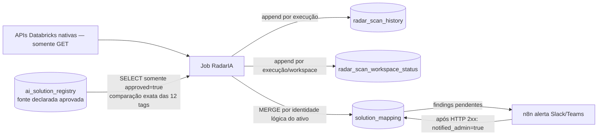

# Modelo de dados Delta — governança de soluções de IA

Este documento descreve o schema de referência implementado em `databricks/sql/00-governance-schema.sql` e o comportamento efetivo do notebook RadarIA. Os nomes padrão são `governance.ai_inventory.*`; adapte-os ao catálogo/esquema corporativo antes da implantação.

## Visão geral

O modelo separa **declaração aprovada**, **evidência histórica da coleta**, **saúde da varredura** e **estado operacional atual por ativo**:



O AI Registry é a **fonte de verdade declarada**. As tags nativas encontradas são evidência observada, não são corrigidas nem gravadas de volta. O RadarIA tem acesso de leitura aos ativos/tags e escreve apenas nas tabelas de governança. O n8n pode atualizar os marcadores operacionais da tabela `solution_mapping`, mas não altera as tags nativas.

## Schema padrão

`governance` é o catálogo e `ai_inventory` o schema Unity Catalog. O DDL cria quatro tabelas Delta:

| Tabela | Finalidade | Comportamento de escrita |
|---|---|---|
| `ai_solution_registry` | Declarações de soluções e combinações de tags aprovadas pelos responsáveis pelo Registry. | Lida pelo RadarIA; não é populada ou aprovada automaticamente pelo Job. |
| `radar_scan_history` | Evidência imutável de cada ativo observado em cada execução. | Append-only, uma linha por ativo observado na execução. |
| `radar_scan_workspace_status` | Resultado da coleta por workspace/fase, inclusive falhas parciais. | Append-only, preserva o resultado de cada execução. |
| `solution_mapping` | Último estado conhecido do ativo e resultado da comparação com o Registry; base dos findings e dashboards. | `MERGE` pelo identificador lógico do ativo; o histórico completo fica em `radar_scan_history`. |

O DDL de referência não declara nem impõe chaves primárias, estrangeiras ou unicidade. As chaves abaixo são **lógicas e usadas pelo código**; controles de qualidade para impedir declarações duplicadas no Registry devem ser mantidos pelo processo corporativo responsável.

## Dicionário de dados

### `ai_solution_registry` — declaração aprovada

| Coluna | Tipo | Significado |
|---|---|---|
| `ai_project_id` | STRING NOT NULL | Identificador governado do projeto de IA. |
| `ai_solution` | STRING NOT NULL | Slug da solução. |
| `ai_component` | STRING NOT NULL | Componente esperado, por exemplo `genie_agent` ou `model_serving`. |
| `environment` | STRING NOT NULL | Ambiente declarado (`dev`, `qa`, `staging`, `prod`). |
| `business_unit` | STRING NOT NULL | Unidade de negócio responsável. |
| `owner_team` | STRING NOT NULL | Grupo institucional responsável. |
| `cost_center` | STRING NOT NULL | Centro de custo. |
| `data_classification` | STRING NOT NULL | Classificação de dados. |
| `risk_tier` | STRING NOT NULL | Nível de risco. |
| `criticality` | STRING NOT NULL | Criticidade operacional. |
| `lifecycle` | STRING NOT NULL | Fase de vida da solução. |
| `chargeback_model` | STRING NOT NULL | Regra de alocação de custos. |
| `approved` | BOOLEAN NOT NULL | Só linhas `TRUE` participam da homologação. |
| `registry_owner` | STRING | Responsável pelo registro/aprovação. |
| `approved_at` | TIMESTAMP | Momento da aprovação. |
| `updated_at` | TIMESTAMP | Última atualização declarada no Registry. |

**Chave lógica de comparação:** a tupla das 12 tags canônicas, na mesma ordem acima (de `ai_project_id` a `chargeback_model`). O Scanner procura correspondência exata em linhas `approved = TRUE`. `approved_at` e `registry_owner` são metadados e não entram na comparação. A tabela é criada vazia como referência: carregue dados aprovados pelo processo oficial; não use os valores de exemplo comentados no SQL.

### `radar_scan_history` — histórico de observações

| Coluna | Tipo | Significado |
|---|---|---|
| `scan_run_id` | STRING NOT NULL | UUID que identifica a execução completa do Job. |
| `scanned_at` | TIMESTAMP NOT NULL | Horário UTC da coleta. |
| `agent_id`, `agent_name`, `agent_type` | STRING | Identidade e tipo do ativo retornados pela API. |
| `workspace_id`, `workspace_name`, `workspace_url` | STRING | Workspace de origem. |
| `endpoint_name` | STRING | Serving endpoint associado, quando fornecido pela API do ativo. |
| `observed_tags` | MAP<STRING, STRING> | Cópia somente de leitura das tags encontradas; pode conter tags além das 12 canônicas. |
| `tag_read_status` | STRING | `OK`, `EMPTY` ou `ERROR`, conforme a leitura da tag. |
| `tag_error` | STRING | Erro de consulta quando a leitura falha. |

Cada execução adiciona novas linhas; a tabela não é sobrescrita pelo Job. `scan_run_id` e `scanned_at` permitem comparar execuções e rastrear a evidência que produziu determinado diagnóstico.

### `radar_scan_workspace_status` — cobertura e saúde da varredura

| Coluna | Tipo | Significado |
|---|---|---|
| `scan_run_id`, `scanned_at` | STRING / TIMESTAMP | Execução e horário a que o status pertence. |
| `workspace_id`, `workspace_name` | STRING | Workspace avaliado; podem ser nulos para falhas sem workspace identificado. |
| `phase` | STRING | Fase da execução, normalmente `inventory`; falhas sem workspace preservam a fase específica. |
| `status` | STRING | `SUCCESS`, `PARTIAL` ou `ERROR`. |
| `error_message` | STRING | Resumo dos endpoints/fases que falharam. |

`SUCCESS` significa que o workspace foi lido sem erro; `PARTIAL`, que ao menos uma listagem funcionou, mas houve falha em outra etapa; `ERROR`, que não houve listagem bem-sucedida. A tabela serve para não confundir “nenhum ativo encontrado” com “não consegui consultar o workspace”. Se a execução não conseguir ler nenhum workspace, o notebook falha **antes de atualizar as tabelas de inventário**.

### `solution_mapping` — estado por ativo e De-Para

A chave lógica do `MERGE` é **(`agent_id`, `agent_type`, `workspace_id`)**. Ela identifica o mesmo ativo dentro do mesmo workspace sem confundir ativos de tipos diferentes ou de workspaces distintos. O código não depende do nome do ativo como identificador, pois nomes podem mudar ou se repetir.

| Coluna | Tipo | Significado |
|---|---|---|
| `agent_id`, `agent_type`, `workspace_id` | STRING | Identidade lógica usada pelo `MERGE`. |
| `agent_name`, `workspace_name` | STRING | Nomes descritivos observados na varredura. |
| `observed_tags` | MAP<STRING, STRING> | Snapshot das tags nativas lidas; não é a fonte declarada e não é enviado de volta ao workspace. |
| `ai_project_id`, `ai_solution` | STRING | Valores extraídos do snapshot para localizar a declaração. |
| `homologated_flag` | BOOLEAN | `TRUE` somente quando a validação termina em `CONFORME`. |
| `compliance_status` | STRING | `CONFORME`, `PARCIAL` ou `NÃO_HOMOLOGADO`. |
| `compliance_reasons` | ARRAY<STRING> | Tags ausentes/inválidas, problemas de leitura ou diferenças frente ao Registry. |
| `first_seen_at` | TIMESTAMP | Primeira observação conhecida daquele ativo; preservada em atualizações seguintes. |
| `last_seen_at` | TIMESTAMP | Horário da varredura mais recente que observou o ativo. Não representa o horário do alerta. |
| `notified_admin` | BOOLEAN | `TRUE` quando o finding não conforme e inalterado já teve seu alerta entregue com HTTP 2xx; `FALSE` para findings pendentes e ativos conformes. |
| `updated_by` | STRING | Identidade/processo da última atualização: normalmente `radarIA` na varredura ou `n8n-governance-alert` após entrega. |
| `alert_signature` | STRING | SHA-256 do ativo, status, tags observadas e motivos; permite detectar se um finding mudou. |
| `tag_read_status` | STRING | Resultado da leitura das tags nativas (`OK`, `EMPTY`, `ERROR`). |

`last_seen_at` é atualizado pelo Job quando o ativo é observado. Depois de um alerta bem-sucedido, o n8n atualiza apenas `notified_admin` e `updated_by`, preservando a semântica de `last_seen_at`. O schema não possui um campo de horário de notificação (`notified_at`); para esse timestamp, use o histórico de execução do n8n ou adicione uma tabela de auditoria dedicada se a política exigir retenção persistente do comprovante de entrega.

## Regras de classificação

1. O RadarIA lê apenas declarações aprovadas (`approved = TRUE`) e as tags observadas via APIs Databricks somente leitura.
2. Se `ai_project_id`/`ai_solution` não identificarem uma linha aprovada, o estado é `NÃO_HOMOLOGADO`.
3. Se a identidade da solução existir, mas houver tag canônica ausente, inválida, divergente, duplicada ou com erro de leitura, o estado é `PARCIAL`.
4. Só há `CONFORME` quando as 12 tags obrigatórias estão presentes/válidas, `ai_component` combina com o tipo do ativo e a tupla observada coincide exatamente com uma declaração aprovada. Tags adicionais podem permanecer em `observed_tags`; elas não substituem as 12 canônicas.
5. O gate de produção aplica a regra adicional `environment=prod` e `lifecycle=production` e bloqueia sem declaração exata aprovada.

## Ciclo de atualização do `solution_mapping`

1. **Leitura:** o Job enumera workspaces e ativos, consulta tags com `GET` e lê o Registry aprovado. Não corrige tags nativas.
2. **Histórico e cobertura:** registra observações em `radar_scan_history` e resultado de acesso em `radar_scan_workspace_status`, ambos em append.
3. **Homologação:** calcula status, motivos e `alert_signature` para cada ativo observado.
4. **MERGE:** por (`agent_id`, `agent_type`, `workspace_id`), atualiza o snapshot em `solution_mapping`; preserva `first_seen_at`, avança `last_seen_at` e calcula o estado de notificação. Nenhum dado é enviado de volta para a API de tags.
5. **Alerta:** o n8n consulta linhas `notified_admin = FALSE` e status diferente de `CONFORME`. Após webhook retornar HTTP 2xx, marca o finding como entregue. Falhas deixam o finding pendente para nova tentativa.
6. **Realerta:** enquanto a assinatura do finding permanecer igual, o estado entregue é preservado. Se tags, status ou motivos mudarem, a assinatura muda e um finding não conforme volta a ficar pendente. Se o ativo ficar `CONFORME`, `notified_admin` é `FALSE`, mas ele não entra na seleção de alertas por causa do filtro de status.

**Retenção de ativos ausentes:** o `MERGE` processa ativos que foram observados; ele não executa `DELETE` para ativos ausentes em uma execução posterior e não os marca automaticamente como removidos. Portanto `solution_mapping` é o último estado conhecido por ativo, não uma lista transacional de ativos atualmente ativos. Use `last_seen_at` junto com `radar_scan_workspace_status` e o histórico de execuções para avaliar atualidade/cobertura. Não interprete ausência de observação em uma varredura parcial como remoção real.

## Consultas úteis

Findings não conformes ainda pendentes:

```sql
SELECT agent_id, agent_name, agent_type, workspace_id,
       ai_project_id, ai_solution, compliance_status,
       compliance_reasons, last_seen_at
FROM governance.ai_inventory.solution_mapping
WHERE COALESCE(notified_admin, FALSE) = FALSE
  AND COALESCE(compliance_status, 'NÃO_HOMOLOGADO') <> 'CONFORME'
ORDER BY last_seen_at DESC;
```

Contagem por status e recência:

```sql
SELECT compliance_status,
       COUNT(*) AS assets,
       SUM(CASE WHEN homologated_flag THEN 1 ELSE 0 END) AS homologated,
       SUM(CASE WHEN COALESCE(notified_admin, FALSE) THEN 1 ELSE 0 END) AS alerts_delivered,
       MAX(last_seen_at) AS most_recent_observation
FROM governance.ai_inventory.solution_mapping
GROUP BY compliance_status;
```

Cobertura da última execução (substitua o UUID pelo `scan_run_id` desejado):

```sql
SELECT workspace_id, workspace_name, phase, status, error_message
FROM governance.ai_inventory.radar_scan_workspace_status
WHERE scan_run_id = '<scan_run_id>'
ORDER BY workspace_name, phase;
```

## FinOps e tabelas de sistema

`databricks/sql/10-finops-ai-monitoring.sql` faz consultas somente leitura a `system.billing.usage` e `system.ai_gateway.usage`. Essas são **tabelas de sistema Databricks**, não são criadas pelo schema `governance.ai_inventory`. A primeira agrega DBUs por tags customizadas de billing; a segunda agrega requisições/tokens/latência pelos request tags do AI Gateway. Disponibilidade, permissões e nomes de colunas dependem das tabelas de sistema habilitadas no workspace/conta.
